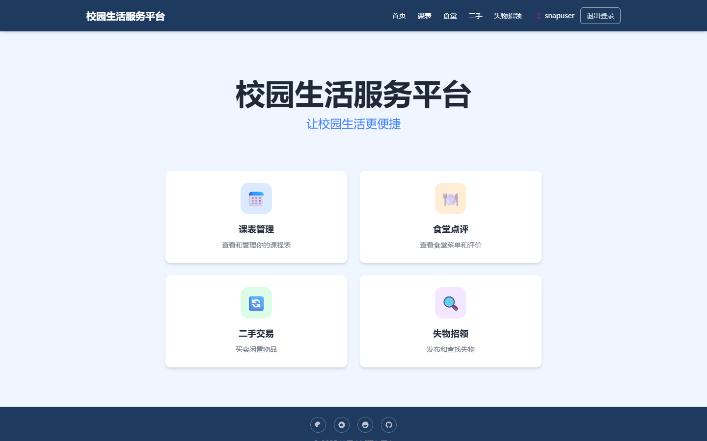
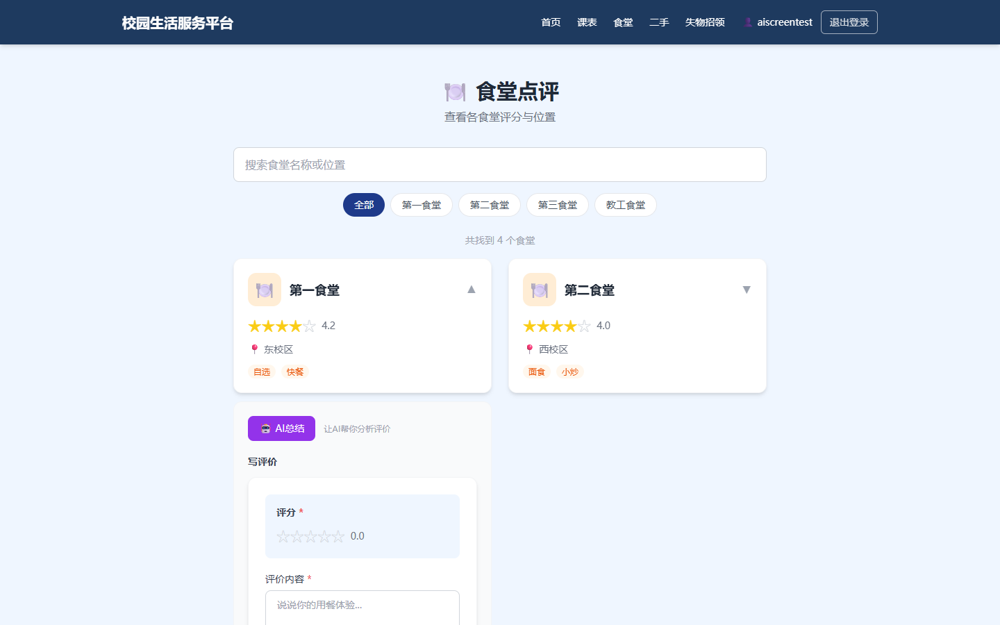
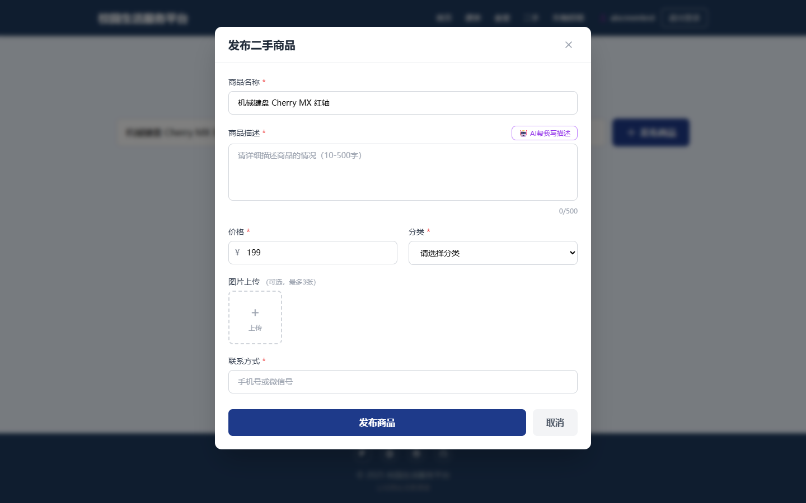
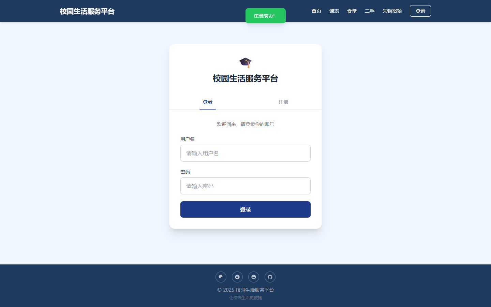
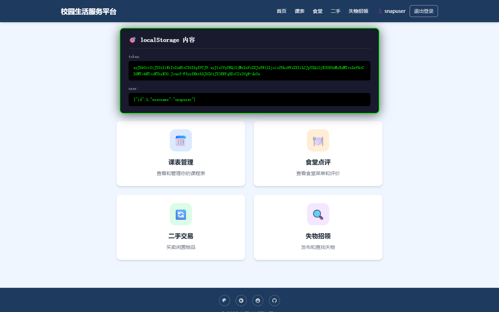
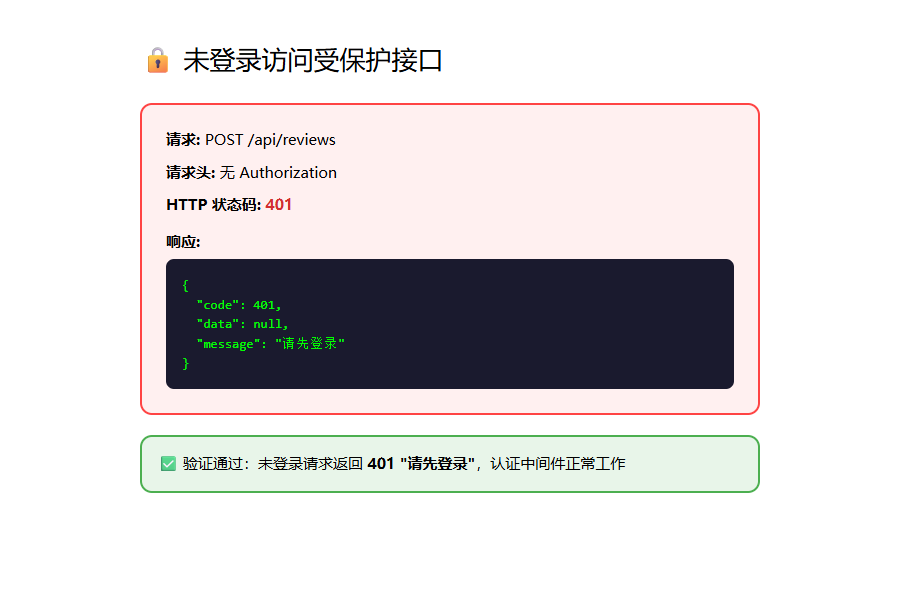

# 🎓 校园生活服务平台

一站式校园生活综合服务平台，集成食堂点评、二手交易、失物招领、AI智能助手等核心功能，为在校师生提供便捷的校园生活服务。



---

## ✨ 功能列表

### 🍽️ 食堂点评
- 查看各食堂评分、位置、标签信息
- 搜索和分类筛选食堂
- 提交评价、打分（需登录）
- 🤖 **AI评价总结** — 一键生成食堂口碑三句话总结（整体口碑、推荐菜品、价格水平）



### 🔄 二手交易
- 浏览闲置商品列表（含分类、价格、卖家信息）
- 搜索商品、分类筛选
- 商品收藏（❤️ 喜欢功能）
- 发布二手商品（需登录，支持图片上传）
- 🤖 **AI商品描述生成** — 自动生成吸引人的商品文案（含 emoji）



### 🔍 失物招领
- 查看丢失/捡到的物品列表
- 按类型（丢失/捡到）筛选
- 发布失物招领信息（需登录）

### 🔐 用户认证
- 用户注册（用户名+密码，bcrypt 加密）
- 用户登录（JWT Token，7天有效期）
- 登录状态持久化（localStorage）
- 权限拦截：未登录无法发布/修改内容




### 🛡️ 权限控制
- 未登录访问受保护接口 → **401 请先登录**
- 修改他人资源 → **403 无权修改**



### 🤖 AI 智能模块
- **AI 评价总结** — 基于食堂评价调用 DeepSeek API 生成三句话总结
- **AI 商品描述** — 根据商品信息自动生成活泼的二手商品描述
- 15秒超时保护，友好的错误提示

---

## 🛠️ 技术栈

| 层级 | 技术 |
|------|------|
| **前端框架** | React 19 + TypeScript |
| **构建工具** | Vite 5 |
| **样式** | Tailwind CSS 3 |
| **路由** | React Router v7 |
| **后端框架** | Express 5 (Node.js) |
| **数据库** | SQLite (sql.js) |
| **认证** | JWT (jsonwebtoken) + bcryptjs |
| **AI 模型** | DeepSeek Chat API |
| **部署前端** | Vercel |
| **部署后端** | Railway |

---

## 🔗 部署链接

| 服务 | 地址 |
|------|------|
| **前端（Vercel）** | [https://campus-life-platform-zeta.vercel.app](https://campus-life-platform-zeta.vercel.app) |
| **后端 API（Railway）** | [https://campus-life-platform-production.up.railway.app](https://campus-life-platform-production.up.railway.app) |
| **GitHub 仓库** | [https://github.com/jiangman-gx/campus-life-platform](https://github.com/jiangman-gx/campus-life-platform) |

---

## 🚀 本地运行方法

### 前置要求
- Node.js >= 18
- npm >= 9

### 1. 克隆项目

```bash
git clone https://github.com/jiangman-gx/campus-life-platform.git
cd campus-life-platform
```

### 2. 安装依赖

```bash
npm install
```

### 3. 配置环境变量（可选）

创建 `.env` 文件（如需使用 AI 功能）：

```env
DEEPSEEK_API_KEY=你的DeepSeek_API_Key
DEEPSEEK_API_BASE=https://api.deepseek.com
```

### 4. 启动后端

```bash
npm run server
```

后端默认运行在 `http://localhost:3001`

### 5. 启动前端

```bash
npm run dev
```

前端默认运行在 `http://localhost:5173`

> 前端通过 Vite 代理将 `/api` 请求转发到 `localhost:3001`，无需额外配置跨域。

### 6. 打开浏览器

访问 [http://localhost:5173](http://localhost:5173)

---

## 📁 项目结构

```
campus-life-platform/
├── server/                  # 后端
│   ├── database/           # 数据库初始化、连接
│   ├── middleware/         # 认证中间件
│   ├── routes/            # 路由模块
│   │   ├── ai.js          # AI 接口（评价总结、商品描述）
│   │   ├── auth.js        # 注册、登录、用户信息
│   │   ├── canteens.js    # 食堂
│   │   ├── items.js       # 二手商品
│   │   ├── lost-found.js  # 失物招领
│   │   └── reviews.js     # 评价
│   └── index.js           # 入口文件
├── src/                    # 前端
│   ├── components/        # 可复用组件
│   ├── pages/             # 页面
│   ├── config/            # 配置（API 地址等）
│   └── App.tsx            # 根组件
├── public/                 # 静态资源
├── vercel.json             # Vercel 部署配置
├── package.json
└── vite.config.js
```

---

## 📊 测试报告

- [测试报告文档](测试报告-校园生活服务平台.docx)
- [Bug 修复报告](Bug修复报告.docx)

所有测试用例 **46 个全部通过**，通过率 **100%**。

---

## 📄 许可证

MIT
